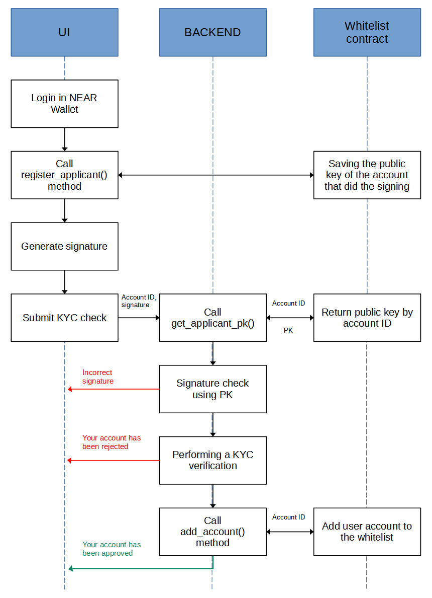

# Smart whitelist contract

The purpose of this contract is to maintain a white list of accounts which have successfully passed KYC verification.

The contract also includes a list of service accounts that have right to add accounts to the whitelist on the side of the backend of the Smart-whitelist KYC module. An administrator can create or delete service accounts in the contract with the help of public key which is stored in the contract during initialization.

The description of the algorithm for adding an account to the white list using the components of the user interface, backend and smart contract of the KYC module below:



Applicant should pre-register it’s public key in the contract in order to be included in the white list by calling the method register_applicant():
```
pub fn register_applicant(&mut self) -> Option<PublicKey>;
```

Also you can check the presence of a key in the contract using the following method:
```
pub fn get_applicant_pk(&self, applicant_account_id: AccountId) -> Option<PublicKey>;
```

Or you can remove key from the contract if it didn't pass verification:
```
pub fn remove_applicant(&mut self) -> Option<PublicKey>;
```

The backend adds the verified account to the white list after successful completion of KYC verification of client documents:
```
pub fn add_account(&mut self, account_id: AccountId) -> bool;
```
Information about the public key of the applicant is removed from the contract after adding an account to the white list.

The account can be removed from the whitelist by the service account in case if it’s needed:
```
pub fn remove_account(&mut self, account_id: AccountId) -> bool;
```

You can check if account is in the white list using the following method:
```
pub fn is_whitelisted(&self, account_id: AccountId) -> bool;
```
